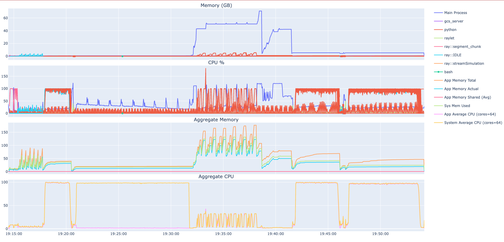

# Testing

There are two types of testing for ISOFIT: pytests and examples. Generally, the pytests target specific functions to validate their outputs or seek coverage by hitting as many lines of the codebase as possible. The examples are reserved for real-world test cases and serve as greater examples of how to execute ISOFIT.

The pytest cases must be passed before any code revisions are accepted. Examples are recommended to run through as well but are not directly checked for.

## Pytests

To start, ensure `pytest` is installed via one of the following methods within the repository root:

Method | Command
-|-
pip | `pip install -e ".[test]"`
uv | `uv sync --optional test`

There are three subtypes of pytests:

Subtype | Time | Description
-|-|-
unmarked | Short | All of the generic test cases of small size
examples | Medium | Runs through a few of the examples
slow | Long | Full apply_oe tests

It is strongly recommended to execute each subtype separately. This can be done via the `-m/--marker` flag, for example:

```
$ pytest -m unmarked
$ pytest -m examples
$ pytest -m slow
```

<blockquote style="border-left: 5px solid lightblue; padding: 0.5em 1em; margin: 1em 0;" markdown="1">

:information_source: You may see an <span style="color: yellow; background: black">x</span> for some test cases. These are *expected* failures and are considered as a **pass**

</blockquote>

## Examples

The ISOFIT tutorials contains more test cases and notebooks not captured by the pytests. Although these are not checked before pull requests are accepted, they will eventually be noticed as every version update to the tutorials repository will trigger a reprocess of the notebooks. It may be useful to lean on these to further validate any changes.

More information may be found in the [notebooks]() section.

# Profiling

ISOFIT presently supports two types of profiling: cProfile and resources.

cProfile is a Python module that profiles each individual function call. The output is a data file that can be visualized using tools like [Snakeviz](https://jiffyclub.github.io/snakeviz/).

Resources is an in-house system resources tracker for ISOFIT that is multiprocessing-friendly. Every polling interval will append the system's present CPU and memory resources in use by ISOFIT in an easily parseable JSON list file. This can be visualized using the [isoplots](https://github.com/isofit/isofit-plots) package.

## cProfile

### How to Use

ISOFIT implements an easy-to-use `--profile` option on `apply_oe`:

```
$ isofit apply_oe ... --profile profile.dat
```

Which can then be visualized:

```
$ snakeviz profile.dat
```

<blockquote style="border-left: 5px solid yellow; padding: 0.5em 1em; margin: 1em 0;" markdown="1">

:warning: cProfile does not capture Ray processes well. ISOFIT has a ray wrapper to circumvent it and force the entire system into serial by setting the environment variable `ISOFIT_DEBUG=1`.

</blockquote>

### Outputs and Analysis

Once a profiling data file is produced, there are a variety of ways to explore the results.


The above image uses [Snakeviz](https://jiffyclub.github.io/snakeviz/) to visualize the profiler results. This is the icicle view which shows the root at the top and all calls made by that function below it.

Clicking on a block will set that block as the root. This allows you to explore what functions and modules are calling others.

The time shown on each block is the cumulative time spent in that function. Children functions may have greater cumulative times than the parent, but that is because those functions were called elsewhere during the run.


The lower half of the visualizer includes the result values. There are six columns:

Column | Description
-|-
ncalls | The number of calls to this function
tottime | The total time spent in the given function (and excluding time made in calls to sub-functions)
percall | The quotient of `tottime` divided by `ncalls`
cumtime | The cumulative time spent in this and all subfunctions (from invocation till exit). This figure is accurate even for recursive functions.
percall | The quotient of `cumtime` divided by primitive calls
filename:lineno(function) | Provides the respective data of each function

Depending on what information you are seeking, these columns may be sorted high/low. This example uses the high sort of `tottime` to analyze what functions take the most total time over the run.

### Further Reading

Read the Docs: https://docs.python.org/3/library/profile.html
In-depth guide: https://www.machinelearningplus.com/python/cprofile-how-to-profile-your-python-code/

## Resources

Similarly to cProfile, resources may be enabled via the `--resources` on `apply_oe`:

```
$ isofit apply_oe ... --log_file logs.txt --resources
```

The output file is automatically set as the same directory as the log file, so that is required to be enabled as well.

### Visualizing



Isoplots can be installed via `isofit download plots` and once a resources.jsonl file is acquired, can be visualized via:

```
$ isofit plot resources resources.jsonl -o resources.html
```

A lot of options are available to further configure the output plots:

```
$ isofit plot resources --help
```

The output is an html file that can be viewed within the browser. The plots are interactive with features such as zooming in toggling legend elements.
